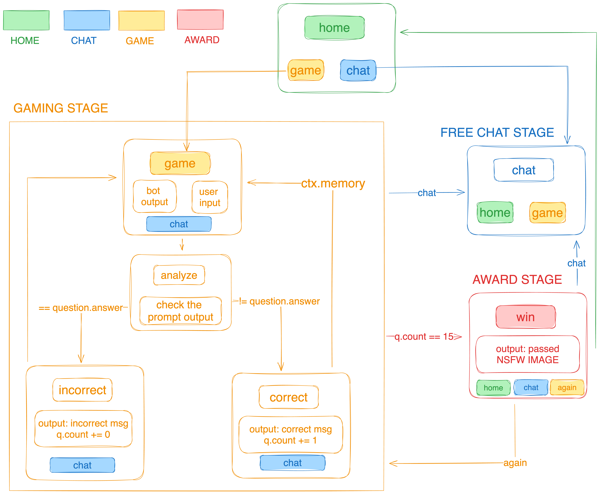

# MyShell ProConfig Generator

Welcome to the MyShell ProConfig Generator project! This command-line interface (CLI) tool is designed to streamline the creation of your custom MyShell configurations.

## Issues with Current MyShell Configurations
Currently, users face several challenges with MyShell configurations:
1. Config files are monolithic, making them difficult to manage and edit.
2. There is a lack of security checks within the configuration process.
3. Code inclusion is cumbersome, with escaping issues posing significant difficulties.

## Project Goals
The aim of this project is to transform MyShell's `proconfig` into a more manageable YAML format. By leveraging the extensibility of YAML, we can:
- Split the `proconfig` into manageable sections.
- Introduce a rendering process to check the relationships between various configuration states, thereby reducing the likelihood of bugs.
- Offload the responsibility of escaping characters to Python, removing the need to handle it directly within JSON.

## How It Works
The MyShell ProConfig Generator takes your existing `proconfig` and converts it into a YAML representation. During the conversion, the tool performs checks and validations to ensure that the integrity and security of your configuration are maintained.

## Getting Started
To get started with the MyShell ProConfig Generator, clone this repository and follow the setup instructions. This project requires Python to be installed on your system.

```
git clone https://github.com/cybernagle/proconfig-generator.git
cd proconfig-generator
pip install -r requirments.txt
./pcc y2j main.yaml
```

Feel free to contribute to the project by submitting pull requests or reporting issues. Together, we can make MyShell configuration a breeze!

## License
This project is released under the MIT License.


## Ad

A llm riddle challenge game implementation on $myshell is based on this generator, if you like this project , please participate with my [Master Prompting Bot](https://app.myshell.ai/bot/Bz6Rbu/1713262101), Thanks a lot!


below is the state machine you may find interesting :)


